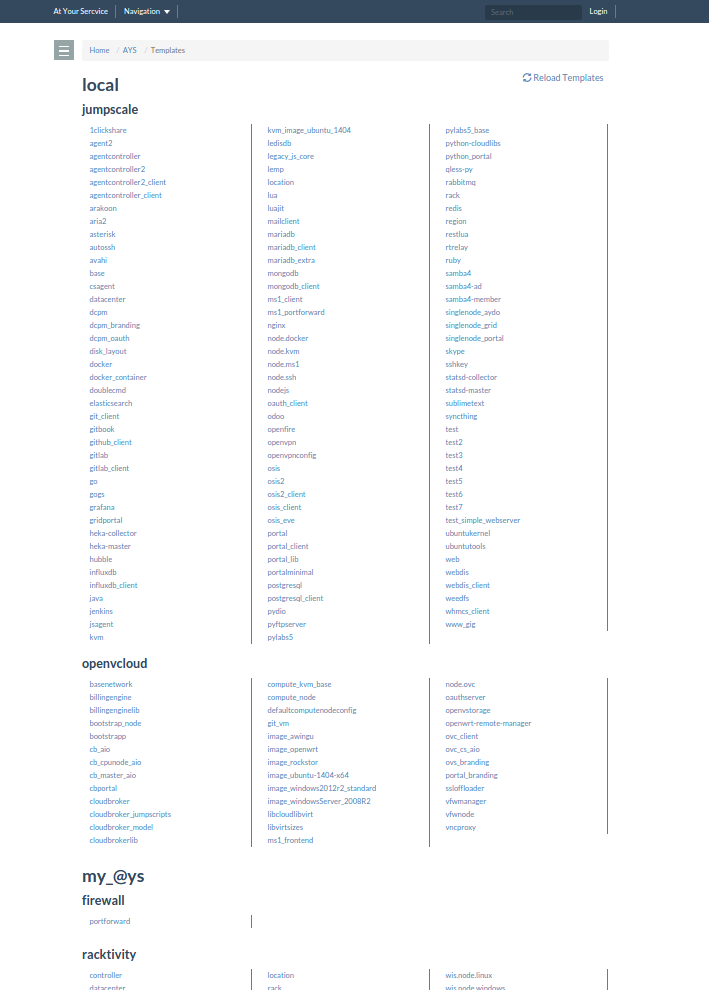
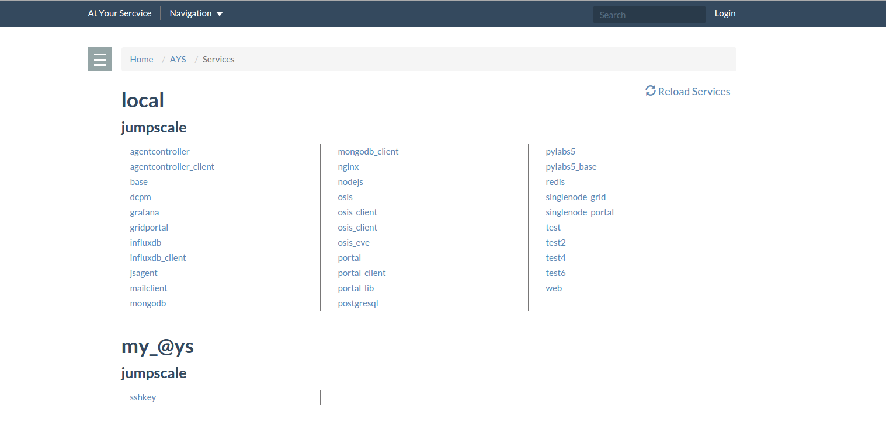
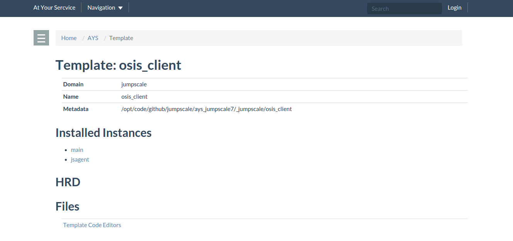
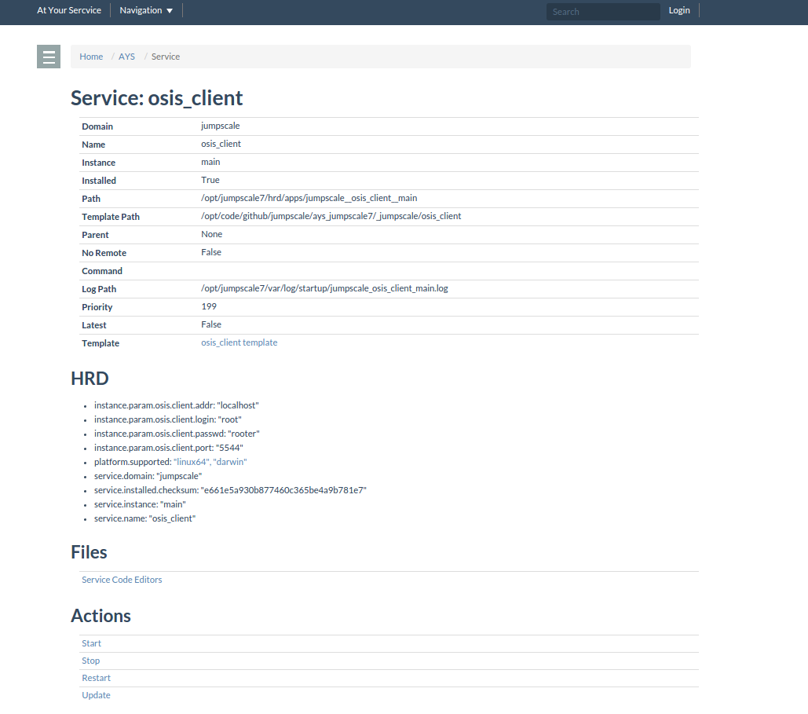

# AYS Portal

AYS services and templates are visualized in the **AYS Portal**.

> Note that it is probably better to use the **Cockpit Portal** instead, check the [Cockpit Portal documentation](https://www.gitbook.com/book/gig/cockpit/details) for more details.

## Templates list



The **Templates** page lists all the AYS servive templates available on your system as well as configuration templates as defined in /optvar/hrd/system/atyourservice.hrd

```
ays.1                          =
    name:'my_@ys',
    url:'https://git.aydo.com/racktivity/ays.git',

metadata.jumpscale             =
    branch:'master',
    url:'https://github.com/Jumpscale/ays_jumpscale8',

metadata.openvcloud            =
    url:'https://git.aydo.com/0-complexity/openvcloud_ays',
```

The prefix `ays` denotes configuration repos of installed services on another system. The prefix `metadata` denotes domains of templates for local usage.

The templates are separated into "local" templates (further divided by template domain) and -in this example- "my_@ys" which further has two domains defined.

## Services list



The services page lists installed services on the system as well as those configured in the `atyourservice.hrd`.

This makes it easy to see what services are available where as well as how they've been configured.

To reload your services and templates at any point, the reload button will dump its database and reload everything from the freshly.

The details pages offer further information.

## Template details



The **Templates Details** page shows information pertinent to the template; such as its domain, name, metadata path, installed instances (which point to the detail page of those services) and a code editor to easily configure the template.

## Service details



The **Service Details** page shows information pertinent to a service instance.

It gives a link to the actor template used to install.

The code editor gives a handy way to edit/configure the service instance.

You can also perform actions on the service instances through the action links to start/stop/restart the services.

```
!!!
title = "AYS Portal"
date = "2017-04-08"
tags = []
```
