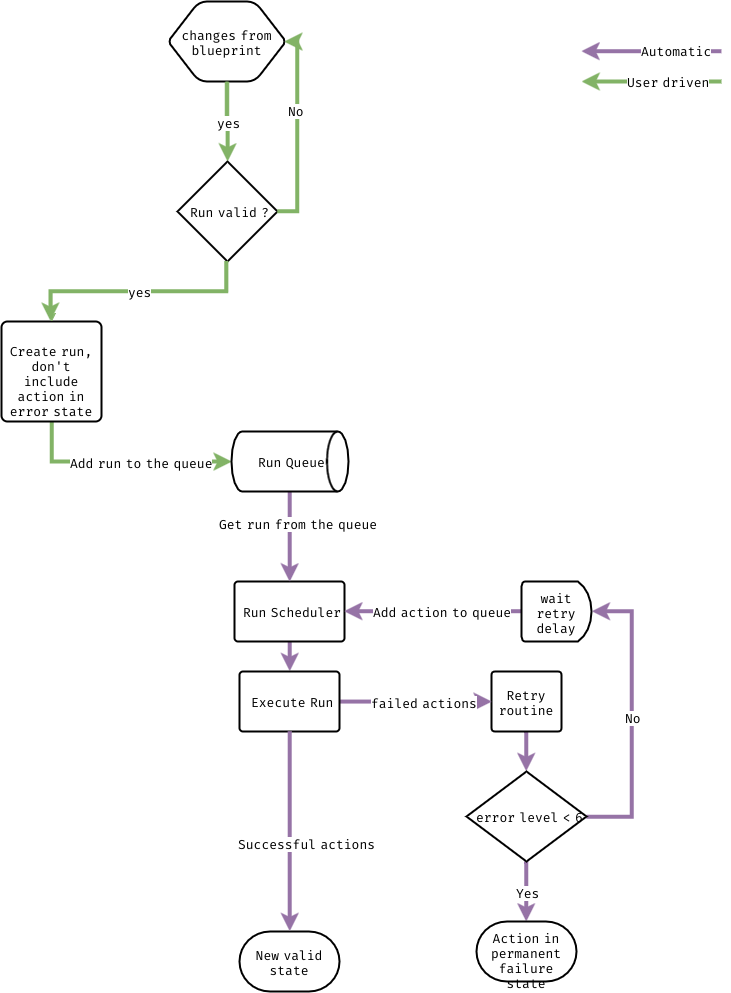

# Run Execution model

## Requirements
AYS is a change management system and to be able to work proprely
we need to ensure that we apply these change in a proper way.
To accomplish that, it allows to have only one `run` to be executing at a time.

Also, when some of the jobs in a run fails, we don't want that to great a dead lock situation where all your services are blocked cause one of the dependencies failed to install.

## Solution
- **Allow only one run to be executed at a time:**  
The solution used in AYS is to use a queue. So everytime a user ask for a run to execute, this requests is push to a queue. Then a the request are extracted from the queue and processed sequentially. This creates a uniq point of execution for all the runs and thus ensure we always only have one running at the same time.

- **Retries failed jobs:**  
When a job fails in a run, this jobs is then reintroduce in the execution loop. We retry to execute the job 6 times in total with a growing delay between the tries.

See the full execution model in the following schema:

