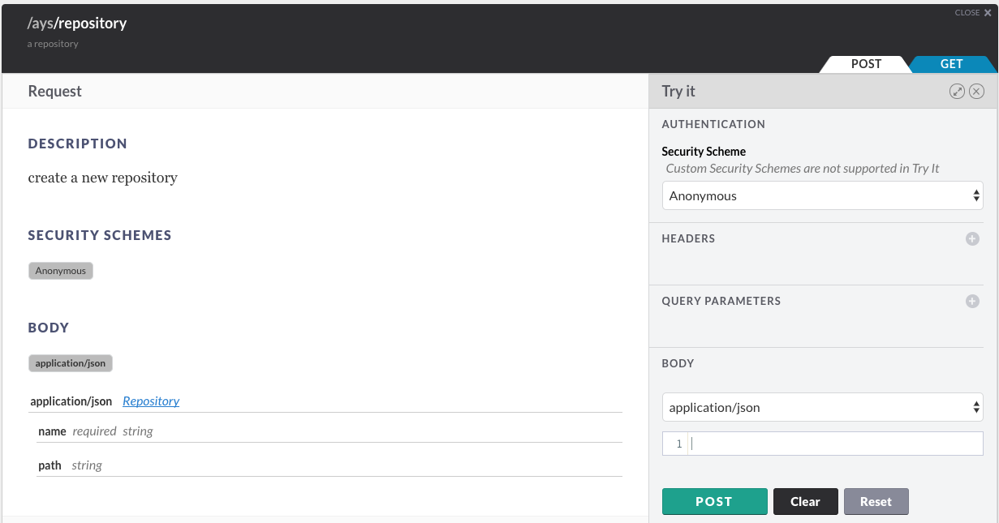

# How to Create a New Repository

You can create an AYS repository in multiple ways:

- [Using the AYS command line tool](#cli)
- [Using the AYS Restful API](#rest)
- [Using the Python client](#python)
- [Using JumpScale client](#using-the-jumpScale-client)
- [Using the AYS Portal](#portal)


<a id="cli"></a>
## Using the AYS command line tool

```
REPO_NAME="..."
GIT_URL="https://github.com/<user>/<repository-name>"
ays repo create -n $REPO_NAME -g $GIT_URL
```

As a result a new repository will be created under `/optvar/cockpit_repos`:
```
cd /optvar/cockpit_repos/$REPO_NAME
```

It contains two empty directories:
- `blueprints`
- `actorTemplates`

Once you add your first blueprint, and execute it, two more directories will be created:

- `actors`
- `services`

See [How to Execute Blueprints](../Execute_blueprint/Execute_blueprint.md) for more details on this.

<a id="rest"></a>
## Using the AYS RESTful API

In order to use the AYS RESTful API you first might need to obtain a JWT, as documented in the section about [How to Get a JWT](../Get_JWT/Get_JWT.md).

Once you got the JWT:

```bash
JWT="..."
REPO_NAME="..."
GIT_URL="https://github.com/user/reponame"
BASE_URL="<IP-address>"
AYS_PORT="5000"
curl -H "Authorization: bearer $JWT" \
     -H "Content-Type: application/json" \
     -d '{"name":"'$REPO_NAME'", "git_url": "'$GIT_URL'"}' \
     https://$BASE_URL:$AYS_PORT/ays/repository
```


<a id="python"></a>
## Using the Python client

Make sure the Python client is installed, as documented in [Install the Python Client](../../gettingstarted/python.md)

```python
from aysclient.client import Client
cl = Client("http://<IP address of your AYS server>:5000")

repo_name="test_repo1"
git_url="http://whatever"

data = {
  "name": repo_name,
  "git_url": git_url
}

cl.ays.createRepository(data)
list=cl.ays.listRepositories()
list.json()
```

## Using the JumpScale client

```python
cl = j.clients.atyourservice.get()

repo_name="test_repo2"
git_url="http://whatever"

data = {
  "name": repo_name,
  "git_url": git_url
}

cl.api.ays.createRepository(data)
cl.api.ays.listRepositories().json()
```

<a id="portal"></a>
## Using the AYS Portal

This requires a running instance of the AYS Portal, as documented in [Start the AYS Portal](../../gettingstarted/portal.md).


