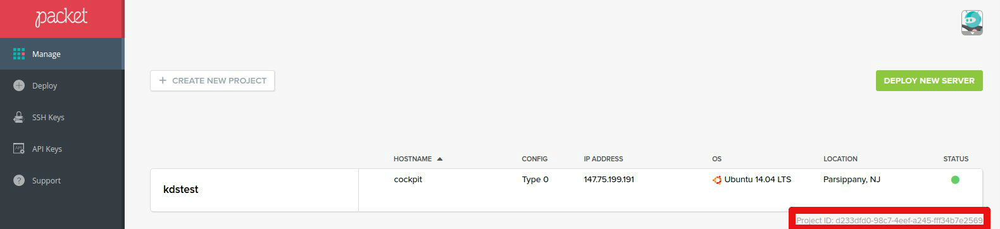

To get the token, login to your packet.net account, create a project and go to your management portal. See: 


example
```

packetnet_client__main:
    token: 'caasadsfsfdsfviv4i1JqadsfsdfgsdMqsdfubGbE'

sshkey__main:
    #mention name of key we are going to use
    key.name: 'ovh_install'

node.packet.net__server1:
    sshkey: 'main'
    client: 'main'
    project.name: 'kdstest'
    plan.type: 'Type 1'
    device.name: 'buildserver'
    device.os: 'Ubuntu 16.04 LTS'
    location: 'amsterdam'


```
